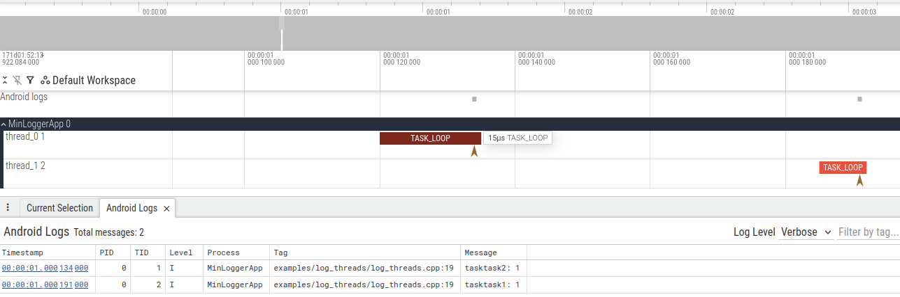

A lightweight, compile-time optimized logging library for embedded systems and resource-constrained environments. Min-logger provides rich logging capabilities with minimal runtime overhead, storage, and bandwidth through use of compile-time ID generation and external metadata mapping.

- [Features](#features)
  - [Core Library (`min_logger.h`)](#core-library-min_loggerh)
  - [Serialization \& Transport](#serialization--transport)
  - [Build-Time Tools (`builder_main.py`)](#build-time-tools-builder_mainpy)
  - [Runtime Tools (`parser_main.py`)](#runtime-tools-parser_mainpy)
- [Quick Start](#quick-start)
  - [Basic Usage (C++)](#basic-usage-c)
  - [Basic Usage (C with Explicit IDs)](#basic-usage-c-with-explicit-ids)
  - [Type Definition JSON Format](#type-definition-json-format)
  - [Including with CMake](#including-with-cmake)
  - [Parsing Logs](#parsing-logs)
- [Configuration](#configuration)
  - [Compile-Time Configuration Macros](#compile-time-configuration-macros)
  - [Log Levels](#log-levels)
  - [Runtime Configuration](#runtime-configuration)
- [Platform Customization](#platform-customization)
  - [Custom Transport](#custom-transport)
  - [Custom Time Source](#custom-time-source)
  - [Custom Thread Identification](#custom-thread-identification)
- [Examples](#examples)
  - [Simple Hello World](#simple-hello-world)
  - [Multi-Threaded Profiling](#multi-threaded-profiling)
  - [Custom Types](#custom-types)
  - [Embedded System Integration](#embedded-system-integration)
- [Macro Reference](#macro-reference)
  - [Message Logging](#message-logging)
  - [Value Logging](#value-logging)
  - [Profiling](#profiling)
- [Architecture](#architecture)
  - [How It Works](#how-it-works)
  - [Built-in Serializer Payload Structures](#built-in-serializer-payload-structures)
- [Performance Characteristics](#performance-characteristics)
- [Testing \& Validation](#testing--validation)
- [Building in Linux](#building-in-linux)
  - [Requirements](#requirements)
  - [Build Commands](#build-commands)
- [PlatformIO](#platformio)
  - [Building the PlatformIO Examples](#building-the-platformio-examples)
- [Future Enhancements](#future-enhancements)


# Features

## Core Library ([`min_logger.h`](src/min_logger/min_logger.h))

- **Zero-Overhead Disabled Logging** - When `MIN_LOGGER_ENABLED=0`, all macros become no-ops with absolutely no runtime cost
- **Dual-Stage Log Level Filtering**
  - Compile-time filtering via `MIN_LOGGER_MIN_LEVEL` macro
  - Runtime filtering via [`min_logger_set_level()`](src/min_logger/min_logger.h) and [`min_logger_get_level()`](src/min_logger/min_logger.h)
- **C++ Auto-ID Generation** - Compile-time CRC32-based message IDs from `__FILE__:__LINE__`, automatically mapped to source locations by build tools
- **C-Compatible Explicit IDs** - C code can use `_ID` macro variants with explicit 32-bit message IDs
- **Fixed-Size Value Logging** - Log individual values with compile-time type checking
- **Variable-Length Array Logging** - Log arrays of any element count without size overhead
- **Execution Flow Tracing** - `MIN_LOGGER_ENTER()` and `MIN_LOGGER_EXIT()` macros for profiling and execution path analysis
- **Message Substitution** - Use `${VALUE_NAME}` in log messages to reference previously logged values

## Serialization & Transport

- **Pluggable Serialization Format** - Custom format support via [`MinLoggerSerializeCallBack`](src/min_logger/min_logger.h)
- **Two Built-in Binary Formats**
  - **Default Format**: Full binary with timestamps and frame synchronization bytes
  - **Micro Format**: Space-optimized for bandwidth-constrained systems (truncated IDs, compact timestamps)
- **Platform-Agnostic Transport** - Weakly-linked hooks allow custom backends:
  - [`min_logger_get_time_nanoseconds()`](src/min_logger/min_logger.h) - System time provider
  - [`min_logger_get_thread_name()`](src/min_logger/min_logger.h) - Thread identification
  - [`min_logger_write()`](src/min_logger/min_logger.h) - Transport mechanism (defaults to stdout)
- **Thread Name Tracking** - [`min_logger_write_thread_names()`](src/min_logger/min_logger.h) triggers automatic thread name broadcast to accociate thread/task names with thread IDs recorded in built in serializations.

## Build-Time Tools ([`builder_main.py`](python/src/min_logger/builder_main.py))

The builder tool scans source code for MIN_LOGGER macros and generates JSON metadata mapping compile-time IDs to source locations.

**Key Capabilities:**
- Automatic extraction of log metadata from C and C++ source files
- Generates mapping files (`*_min_logger.json`) with:
  - Message ID to source file:line mapping
  - Log level and severity classification
  - Value names, types, and array information
  - Custom message templates with variable substitution
- **Type Definition Support** - Custom type serialization via JSON type definitions (see [`examples/custom_type/custom_type_type_defs.json`](examples/custom_type))
- **Multi-Format Support** - Recognizes:
  - `MIN_LOGGER_LOG()` / `MIN_LOGGER_LOG_ID()` - Simple messages
  - `MIN_LOGGER_RECORD_VALUE()` / `MIN_LOGGER_RECORD_VALUE_ID()` - Fixed-size values
  - `MIN_LOGGER_RECORD_AND_LOG_VALUE()` - Values with formatted messages
  - `MIN_LOGGER_RECORD_VALUE_ARRAY()` / `MIN_LOGGER_RECORD_VALUE_ARRAY_ID()` - Variable-length arrays
  - `MIN_LOGGER_ENTER()` / `MIN_LOGGER_EXIT()` - Function entry/exit for profiling
- CRC32 ID generation matching C++ compile-time IDs for verification

**Usage:**
```bash
uv --project python run min-logger-builder <source_dir> \
  --root_paths <root> \
  --json_output <output.json> \
  [--type_defs <type_defs.json>]
```

**Example Output:**
```json
{
  "entries": [
    {
      "id": 1759912994,
      "source_file": "examples/hello_cpp/hello.cpp",
      "source_line": 7,
      "level": 20,
      "msg": "hello world binary",
      "value_type": null,
      "is_array": false
    }
  ],
  "type_defs": {}
}
```

## Runtime Tools ([`parser_main.py`](python/src/min_logger/parser_main.py))

Converts binary log output back to human-readable format with full context restoration.

**Key Capabilities:**
- **Multiple Format Support**:
  - `BINARY` - Full format with complete metadata and sync frames
  - `MICRO_BINARY` - Space-optimized format with truncated IDs
  - Can be extended for additional formats
- **Human-Readable Output** - Converts binary to formatted text with timestamps, source locations, and values
- **CSV Export** - Export parsed metrics to individual CSV files via `--csv_dir`
- **Perfetto Trace Generation** - Generate system trace files (`.pbuf`) for visualization in Perfetto UI: <https://ui.perfetto.dev/>
  - Automatically tracks function entry/exit for execution profiling
  - Thread-aware with thread name tracking
  - Source location mapping for code navigation

- **Variable Substitution** - Automatically substitutes logged values into message templates using `${VALUE_NAME}` patterns

**Usage:**
```bash
uv --project python run min-logger-parser <metadata.json> \
  --log_format [BINARY|MICRO_BINARY] \
  --log_file <binary.log> \
  [--perfetto_out <output.pbuf>] \
  [--csv_dir <csv_output_dir>]
```

**Example Parsed Output:**
```
15328834.560464 INFO  examples/hello_cpp/hello.cpp:7 hello_cpp] hello world binary
15328834.815283 INFO  examples/custom_type/custom_type.cpp:27 custom_type] An integer value: 100
```

# Quick Start

## Basic Usage (C++)

```cpp
#include <min_logger/min_logger.h>

int main() {
    // Log a simple message
    MIN_LOGGER_LOG(MIN_LOGGER_INFO, "Application started");
    
    // Log a value with automatic type checking
    float temperature = 25.5f;
    MIN_LOGGER_RECORD_VALUE(MIN_LOGGER_WARN, "sensor_reading", float, temperature);
    
    // Log a value with a formatted message
    int count = 42;
    MIN_LOGGER_RECORD_AND_LOG_VALUE(MIN_LOGGER_INFO, "loop_count", int, count,
                                    "Loop iteration: ${loop_count}");
}
```

## Basic Usage (C with Explicit IDs)

```c
#include <min_logger/min_logger.h>

int main() {
    MIN_LOGGER_LOG_ID(0x12345678, MIN_LOGGER_INFO, "Application started");
    
    float temperature = 25.5f;
    MIN_LOGGER_RECORD_VALUE_ID(0x12345679, MIN_LOGGER_WARN, "sensor_reading", float, temperature);
}
```

## Type Definition JSON Format

This file is a dictionary of custom or ambiguous types to Python [struct format](https://docs.python.org/3/library/struct.html#format-characters) string values. These can reverence other definitions in the file or C primitives. struct formats must be a number of repetitions and a single value character. Custom types can also start with a number of repetitions for fixed size arrays.

NOTE: These types must be plain old data (POD) types that don't contain any pointers or references.

Example:
```json
{
    "int": "i",
    "Point": {
        "x": "f",
        "y": "f",
        "dummy": "2i"
    },
    "Rect": {
        "pos": "Point",
        "size": "Point",
        "padding": "10x",
        "str": "10s",
        "bytes": "10s"
    }
}
```

## Including with CMake

Include the build helper from [`cmake/BuildLogger.cmake`](cmake/BuildLogger.cmake):

```cmake
add_executable(my_app main.cpp)
target_link_libraries(my_app PUBLIC min_logger)

# Automatically generate metadata JSON from MIN_LOGGER macros
build_min_logger(${CMAKE_CURRENT_SOURCE_DIR} my_app)

# To include a custom type definitions JSON, you can pass an argument for its path
# build_min_logger(${CMAKE_CURRENT_SOURCE_DIR} my_app ${CMAKE_CURRENT_SOURCE_DIR}/my_app_type_defs.json)
```

This generates `my_app_min_logger.json` at build time containing all log metadata.

## Parsing Logs

```bash
# Run your application and capture binary output
./build/examples/hello_cpp > output.bin

# Parse binary log using metadata
uv --project python run min-logger-parser build/examples/hello_cpp/hello_cpp_min_logger.json \
  --log_format=BINARY \
  --log_file=output.bin

# Generate Perfetto trace for visualization
uv --project python run min-logger-parser build/examples/hello_cpp/hello_cpp_min_logger.json \
  --log_format=BINARY \
  --log_file=output.bin \
  --perfetto_out=trace.pbuf

# Export metrics to CSV
uv --project python run min-logger-parser build/examples/hello_cpp/hello_cpp_min_logger.json \
  --log_format=BINARY \
  --log_file=output.bin \
  --csv_dir=metrics/
```

# Configuration

## Compile-Time Configuration Macros

Define these before including `min_logger.h` to customize behavior:

```c
// Enable/disable logging entirely (0 = all overhead eliminated)
#define MIN_LOGGER_ENABLED 1

// Minimum log level to include at compile time
// Messages below this are omitted entirely (compile-time filtering)
#define MIN_LOGGER_MIN_LEVEL (MIN_LOGGER_INFO)

// Default runtime log level (can be changed at runtime)
#define MIN_LOGGER_DEFAULT_LEVEL MIN_LOGGER_WARN
```

## Log Levels

```c
#define MIN_LOGGER_DEBUG 10     // Detailed diagnostic information
#define MIN_LOGGER_INFO 20      // General informational messages
#define MIN_LOGGER_WARN 30      // Recoverable issues
#define MIN_LOGGER_ERROR 40     // Serious problems
#define MIN_LOGGER_CRITICAL 50  // System failures
```

## Runtime Configuration

```c
// Set the runtime log level (works with MIN_LOGGER_MIN_LEVEL)
min_logger_set_level(MIN_LOGGER_DEBUG);

// Set custom serialization format
min_logger_set_serialize_format(MY_CUSTOM_FORMAT);
```

# Platform Customization

Override weakly-linked platform hooks to adapt to your system:

## Custom Transport

```cpp
extern "C" {
    // Called by built-in serializers to send formatted data
    void min_logger_write(const uint8_t* msg, size_t len_bytes) {
        // Example: UART transmission
        uart_send(msg, len_bytes);
    }
}
```

## Custom Time Source

```cpp
extern "C" {
    // Return current time in nanoseconds
    uint64_t min_logger_get_time_nanoseconds() {
        return esp_timer_get_time() * 1000;  // Convert microseconds to nanoseconds
    }
}
```

## Custom Thread Identification

```cpp
extern "C" {
    // Get current thread's name (e.g., for thread name logging)
    size_t min_logger_get_thread_name(char* thread_name, size_t max_len) {
        const char* name = get_current_task_name();
        size_t len = snprintf(thread_name, max_len, "%s", name);
        return len;
    }
}
```

# Examples

## Simple Hello World

- **C Version**: [`examples/hello_c/hello.c`](examples/hello_c/hello.c) - Basic C logging with explicit IDs
- **C++ Version**: [`examples/hello_cpp/hello.cpp`](examples/hello_cpp/hello.cpp) - Basic C++ with auto-generated IDs

## Multi-Threaded Profiling

[`examples/log_threads/log_threads.cpp`](examples/log_threads/log_threads.cpp) demonstrates:
- Thread creation and naming
- Function entry/exit profiling via `MIN_LOGGER_ENTER()` / `MIN_LOGGER_EXIT()`
- Value logging with message substitution
- Switching between default and micro binary formats
- Output parsing for performance analysis

Metadata: [`build/examples/log_threads/log_threads_min_logger.json`](build/examples/log_threads/log_threads_min_logger.json)

## Custom Types

[`examples/custom_type/custom_type.cpp`](examples/custom_type/custom_type.cpp) shows:
- Logging custom struct types
- Type definition JSON configuration
- Complex nested types with arrays
- Message templates with value references

Type Definitions: [`examples/custom_type/custom_type_type_defs.json`](examples/custom_type/custom_type_type_defs.json)

## Embedded System Integration

[`examples/esp32_pio/esp32_hello.cpp`](examples/esp32_pio/esp32_hello.cpp) demonstrates:
- Arduino/ESP32 platform integration
- UART-based transport (`Serial.write()`)
- Time source customization using `micros()`
- PlatformIO build integration via `pio_scripts/generate_logger.py`

# Macro Reference

## Message Logging

```c
// C++ only - auto-generates ID from source location
MIN_LOGGER_LOG(level, "message text");

// C - explicit ID required
MIN_LOGGER_LOG_ID(0x12345678, level, "message text");
```

## Value Logging

```c
// Log a fixed-size value
float temp = 25.5f;
MIN_LOGGER_RECORD_VALUE(level, "temperature", float, temp);

// Log value with formatted message
MIN_LOGGER_RECORD_AND_LOG_VALUE(level, "temperature", float, temp,
                                "Current temp: ${temperature}°C");

// Log variable-length array
int data[10] = {1, 2, 3, ...};
MIN_LOGGER_RECORD_VALUE_ARRAY(level, "sensor_data", int, data, 10);
```

## Profiling

```c
// Mark function/section entry
MIN_LOGGER_ENTER(MIN_LOGGER_DEBUG, my_function);

// ... function body ...

// Mark function/section exit
MIN_LOGGER_EXIT(MIN_LOGGER_DEBUG, my_function);
```

It is fine for multiple sections to be active at once, and sections on different threads are tracked seperately.


# Architecture

## How It Works

1. **Compile Time** ([`builder_main.py`](python/src/min_logger/builder_main.py)):
   - Scan source files for MIN_LOGGER macros
   - Extract log context (file, line, level, message template)
   - Generate CRC32 IDs from source location
   - Output JSON metadata file

2. **Runtime** ([`min_logger.h`](src/min_logger/min_logger.h) + [`min_logger.cpp`](src/min_logger/min_logger.cpp)):
   - MIN_LOGGER macros expand to ID + payload serialization
   - Dual-stage level filtering (compile-time + runtime)
   - Configurable binary serialization
   - Platform hooks for custom transport

3. **Post-Processing** ([`parser_main.py`](python/src/min_logger/parser_main.py)):
   - Load JSON metadata
   - Parse binary log stream
   - Reconstruct source file:line context
   - Substitute values into message templates
   - Export to text, CSV, or Perfetto trace format

## Built-in Serializer Payload Structures

**Default Binary Format:**
```
[sync bytes(16b)][payload_len(8b)][thread_id(8b)][msg_id(32b)][timestamp(64b)][value_data...]
```

**Micro Binary Format (space-optimized):**
```
[truncated_id(16b)][thread_id(4b)][time_scale(2b)][time_value(10b)][value_data...]
```

# Performance Characteristics

- **Disabled** (`MIN_LOGGER_ENABLED=0`): Zero overhead - all macros compile to nothing
- **Enabled, Level Below Threshold**: Single integer comparison (compile-time + runtime)
- **Enabled, Message Logged**: Serialization callback invocation + platform write
- **Memory**: Metadata in JSON (separate from binary), no message strings in firmware
- **Bandwidth**: ~12-16 bytes per message + value data (default format), ~4+ bytes (micro format)

# Testing & Validation

Run the integration test suite:

```bash
./scripts/integration_tests.sh
```

This builds all examples and validates:
- Default binary format parsing
- Micro binary format parsing
- Custom type handling
- Perfetto trace generation
- CSV export

Validate type definitions against compiled binaries:

```bash
uv --project python run min-logger-validate-types \
  build/examples/custom_type/custom_type \
  --type_defs examples/custom_type/custom_type_type_defs.json
```

# Building in Linux

## Requirements

- CMake 3.12+
- C++11 compatible compiler
- Python 3.12+ (for build tools and parsing)
- `uv` package manager (for Python tools)

## Build Commands

```bash
# Configure
cmake -S . -B build -G Ninja -DCMAKE_BUILD_TYPE=RelWithDebInfo

# Build
cmake --build build
```

Alternatively, see [Dockerfile](Dockerfile) for a Docker build example.

# PlatformIO

## Building the PlatformIO Examples

The [platformio.ini](platformio.ini) file is set up to compile examples/esp32_pio. It uses the extra script to call the Python min-logger-builder tool.

An example of using min-logger as a library in a PlatformIO project can be found in [examples/esp32_pio_project](examples/esp32_pio_project). That example includes this repo as a dependancy, and is a template for using min-logger in another repo. This project can be built by opening this directory as the root of a PlatormIO project and running the default build.

# Future Enhancements
* Add way to validate type sizes. Could use objdump of symbols, or GDB? GDB with seperated debug symbols? gdb-multiarch seems to work even for ESP32 (`/usr/bin/gdb-multiarch .pio/build/esp32dev/firmware.elf --batch -ex="output sizeof(int)"`).
* Make parsing robust to transmission errors, add advice for fixing format specification errors
* Making adding custom framing parsers easier. Maybe use <https://github.com/MightyPork/TinyFrame>?
* Make parser more efficient. Both in the framing and the value parsing. Value parsing should at least cache struct format and map to dict. Maybe check out [Kaitai](https://kaitai.io/)?
* Set custom levels per file
* Whitelist by ID
* make argcomplete optional
* Add "tags" to categorize metrics to enable. (tags or logger names?)
* Have generated code look for metric, file, and category allow lists to include metric
* Add functions to log scheduler using cores to run tasks and idle (need special hooks into scheduler)
* Figure out how to handle logging from interrupts. Special functions?
